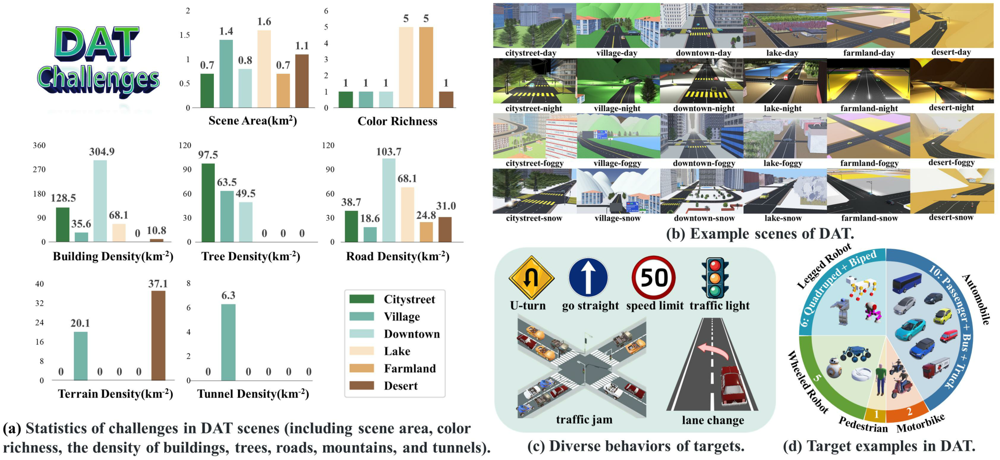

# Open-World Drone Active Tracking with Goal-Centered Rewards
[](LICENSE)
[](https://foriccv2025.github.io/anonymous/)
[](https://foriccv2025.github.io/anonymous/zh/index.html)




## Abstract
Drone Visual Active Tracking aims to autonomously follow a target object by controlling the motion system based on visual observations, providing a more practical solution for effective tracking in dynamic environments. However, accurate Drone Visual Active Tracking using reinforcement learning *remains challenging due to the absence of a unified benchmark and the complexity of open-world environments with frequent interference*. To address these issues, we propose a unified benchmark for open-world drone active tracking called **DAT**. *DAT benchmark provides 24 visually complex environments with high-fidelity target management to assess the algorithms' cross-scene and cross-domain generalization abilities.* Additionally, we propose a reinforcement learning-based drone tracking method called **GC-VAT**, which aims to improve the performance of drone tracking targets in complex scenarios. *Specifically, we design a Goal-Centered Reward to provide precise feedback across viewpoints to the agent, enabling it to adapt to arbitrary perspectives. This allows the drone to expand its perception and movement range. Inspired by curriculum learning, we introduce a Curriculum-Based Training strategy that progressively enhances the agent tracking performance in complex environments.* Experiments demonstrate that **GC-VAT** has about 400% improvement over the SOTA method in terms of the cumulative reward metric.

## Citing
```bibtex
@article{ ,
  title={Open-World Drone Active Tracking with Goal-Centered Rewards},
  author={},
  journal={},
  year={},
  publisher={}
}
```
